```{=html}
<style>
.footer {
  text-align: right;
  padding: 10px;
}
.footer img {
  width: 50px; /* Adjust as needed */
  height: auto;
  margin-left: 10px;
}
</style>
```
```{r setup, include = FALSE}
```

##  {.tabset}

### **Welcome**

#### **Overview**

Welcome to the Upstream User Guide!
[Upstream](https://upstream-cloud-run-jcypjvvn7a-uw.a.run.app) is a flexible R Shiny application designed to inform
fish passage planning efforts in Western Washington. This
guide serves as both a technical manual and a comprehensive overview of
the app's functionalities, including its core features: Welcome,
Explore, Suggest, Custom, and Learn.

In this guide, you'll find detailed explanations of each feature:

-   *Welcome:* Familiarize yourself with the barrier culverts included in our app.

-   *Explore:* Delve into our data and visualize culvert attributes
    within various spatial and ownership boundaries.

-   *Suggest:* Generate restoration plans, which seek to maximize return on           investment, based on your preferences and budget constraint. 

-   *Custom:* Create and assess the impact of your own set of
    restoration projects.

-   *Learn:* Learn about Upstream's data inputs, the project team, and resources for user support.

With helpful tips, step-by-step instructions, and links to related
resources, this guide is your comprehensive companion in utilizing
Upstream effectively and interpreting the results from the app.

To get started, select a tab above for detailed insights into each of
Upstream's unique features.

------------------------------------------------------------------------

#### **Functional Layout**

Welcome is the first tab open when you launch Upstream. As in this first
tab and throughout the app, the left panel accepts user inputs while the
right displays outputs. To navigate through the other features you can
either click on the associated images or the associated tabs in the
upper left of the app just below the title banner.

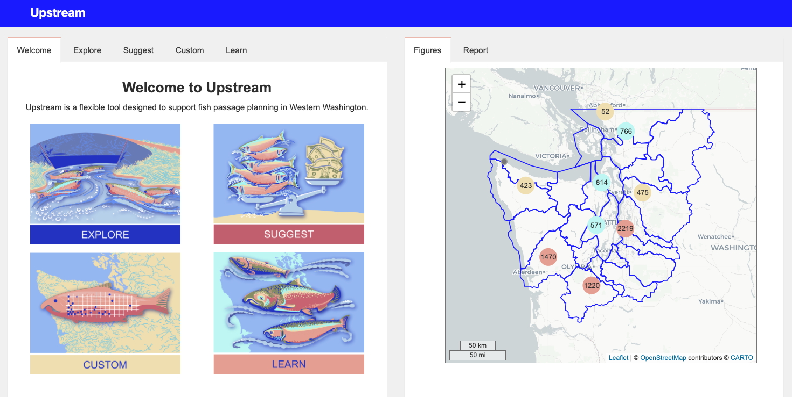

------------------------------------------------------------------------

#### **Interactive Map**

::: columns
::: {.column width="55%"}
The interactive map in the Welcome feature is a key component for
visualizing culvert data and is available throughout the other tabs as
well. Here's how to navigate and use it:

-   **Zoom for Details:** At higher zoom levels, the map displays counts
    of culverts to manage the density of information. As you zoom in,
    individual culverts are revealed, allowing for more detailed
    examination.

-   **Click for Information:** Clicking on a culvert once it's visible
    on the map brings up a callout with culvert data such as the WDFW
    site ID number, a passability estimate, potential fish species, and estimated
    habitat and construction cost.
:::

::: {.column width="5%"}
:::

::: {.column width="40%"}
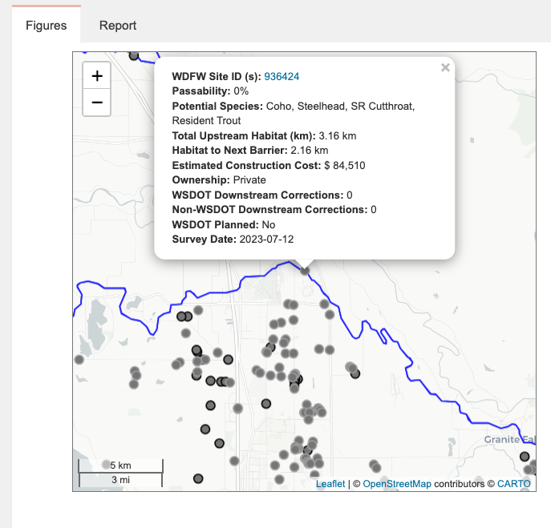
:::
:::

The default map on the right of the Welcome tab is the WDFW culvert
inventory displayed within the Western Washington Case Area divided into
WRIAs. Points with light gray borders are those that we consider "Good
Matches", while those outlined in black are considered "Bad Matches".
Clicking on the individual points allows access to view culvert
attributes from the WDFW inventory, which includes a link to the culvert's
WDFW Fish Passage and Diversion Screening Inventory Database (FPDSI) report. If you are interested in learning more about
these data sets visit the **Data and Resources** tab of this manual.

------------------------------------------------------------------------

#### **Looking for Additional Information?**

::: columns
::: {.column width="80%"}
If you require more details or have specific questions, we're here to
help. Feel free to reach out to us for further assistance or any queries
you might have.
:::

::: {.column width="5%"}
:::

::: {.column width="15%"}
<a href="mailto:jardine@uw.edu" style="background-color: #0044cc; color: white; padding: 10px 20px; text-align: center; text-decoration: none; display: inline-block; border-radius: 5px; font-weight: bold;">Contact
Us</a>
:::
:::

------------------------------------------------------------------------

::: footer
<a href="https://www.washington.edu/" target="_blank">
 </a>
<a href="https://wsg.washington.edu/" target="_blank">
 </a>
:::

### **Explore**

#### **Overview**

::: columns
::: {.column width="55%"}
The Explore feature is designed to visualize culvert attributes within
various spatial and ownership boundaries.

------------------------------------------------------------------------

#### **Getting Started**

Choose the 'Explore' tile on the Upstream landing page or select the the
corresponding tab. This feature automatically displays a map of the
[WDFW fish passage
inventory](https://wdfw.wa.gov/species-habitats/habitat-recovery/fish-passage/assessment)
for Western Washington, updated with each new version of Upstream. It
filters out corrected barriers, non-culvert barriers, and any barrier
culverts situated upstream of [a] non-culvert barrier(s).
:::

::: {.column width="5%"}
:::

::: {.column width="40%"}

:::
:::

------------------------------------------------------------------------

#### **Interactive Map**

::: columns
::: {.column width="55%"}
The interactive map in the Explore feature is a key component for
visualizing culvert data. Here's how to navigate and use it:

-   **Zoom for Details:** At higher zoom levels, the map displays counts
    of culverts to manage the density of information. As you zoom in,
    individual culverts are revealed, allowing for more detailed
    examination.

-   **Click for Information:** Clicking on a culvert once it's visible
    on the map brings up a callout with culvert data such as the WDFW
    site ID number, a passability estimate, potential fish species, and estimated
    habitat and construction cost.

-   **Filtering for Focus:** Utilize the dropdown menus to select
    culverts within specific WRIAs, HUC-12s, and ownership types. This
    tailors the map to show only the data relevant to your interests.
:::

::: {.column width="5%"}
:::

::: {.column width="40%"}

:::
:::

------------------------------------------------------------------------

#### **Map Call-Outs**

::: columns
::: {.column width="55%"}
Zoom into your area of interest and click on a culvert to access
detailed information. The callouts provide insights into:

-   The WDFW Site ID<sup>a</sup>
-   Passability estimates<sup>a</sup>
-   Potential fish species<sup>a</sup>
-   Total habitat upstream of a culvert<sup>b</sup>
-   Habitat upstream of a culvert to next barrier<sup>b</sup>
-   Estimated construction cost<sup>b</sup>
-   Ownership type<sup>a</sup>
-   The number of culverts corrected downstream by WSDOT<sup>b</sup>
-   The number of culverts corrected downstream by other than
    WSDOT<sup>b</sup>
-   Weather WSDOT plans to correct that particular barrier<sup>b</sup>
-   The date the culvert was surveyed<sup>a</sup>

<sup>a</sup> denotes variables from the WDFW inventory and <sup>b</sup>
denotes Upstream variables.
:::

::: {.column width="5%"}
:::

::: {.column width="40%"}

:::
:::

------------------------------------------------------------------------

#### **Area, Subarea, and Ownership**

::: columns
::: {.column width="65%"}

*Area*

To refine the inventory data, use the dropdown menu to select Water
Resource Inventory Areas (WRIAs) of interest,
making sure 'All WRIAs' is deselected. 

*Subarea*

The Subarea selector allows for further spatial refinement, based on HUC12(s), and will auto-populate with subareas contained within the selected WRIA(s).

*Ownership*

The Ownership selector filters the culverts based on their ownership as
defined in the WDFW inventory. This includes City, County, Federal,
Private, State, Tribal, Other, Port, Drainage District, Irrigation
District, and Unknown.

:::

::: {.column width="5%"}
:::

::: {.column width="30%"}
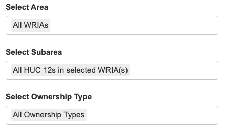
:::
:::

------------------------------------------------------------------------

#### **Defining Habitat Quantity Definition**

Habitat quantity is an important attribute for fish passage planning and
can be quantified in terms of length, area, or volume. By default,
length is used as the primary measure. All quality related habitat variables will subsequently be refined to only consider those weighted by the selected quantity definition. 

{style="width: 30%; display: block; margin-left: auto; margin-right: auto;"}

*Note:* For area and volume calculations, bankfull width and depth are
utilized as outlined in [Bieger et al.
2015](https://onlinelibrary.wiley.com/doi/abs/10.1111/jawr.12282).

------------------------------------------------------------------------

#### **Selecting Plot Type**

With the plot type selection you can specify whether you would like to generate a scatterplot or a histogram from the selected culverts and attribute(s) of interest. Scatterplots are good for examining the relationship between two variables and histograms display the distribution of a single variable.

Once plot type has been selected, you will be prompted to select variables to display. If you select a histogram, you will need to select one variable and the number of bins (from 1 to 100) to visualize the variable's distribution. 

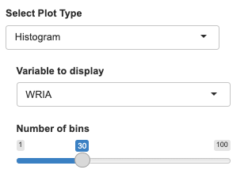

If you select scatterplot, you will be prompted to select an X and a Y variable to display. As there can be overlap between points in the scatterplot, a jitter option is provided for both variables. 

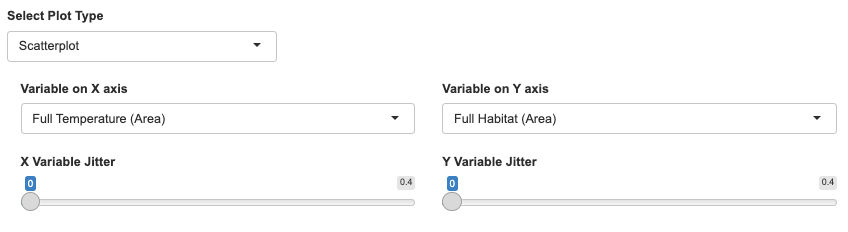

------------------------------------------------------------------------

#### **Select Variable for Point Fill Color **

Additionally, we can select a variable to define a color scheme for the culverts. This will color points on the plot, whether that is a scatterplot or
a histogram, as well as on the interactive map. For continuous
variables, colors are displayed based on the variable being grouped
into 5 quantile ranges. If you refine
your selection spatially or by ownership type, the quantile groups will then reflect the values within the refined selection of culverts. 

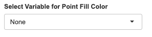

------------------------------------------------------------------------

#### **Highlight Barriers**

To highlight specific culverts, you can select them by their WDFW site ID. This will highlight them both on the map as well as in the scatterplot.

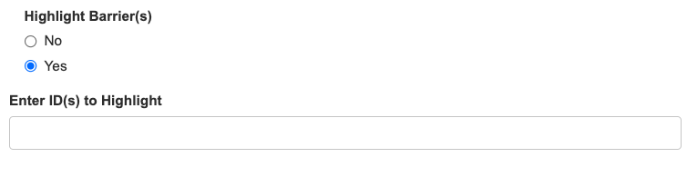

------------------------------------------------------------------------

#### **Remove Bad Matches**

The default selection is to filter out bad matches, however, in the user can choose to include bad matches in the data used to generate plots. Bad matches are those that were identified as not likely associated with a streamline in the NHDPlus HR dataset. More info can be found in the Learn section of this manual. 

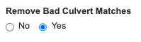

------------------------------------------------------------------------

#### **Submit and Visualization**

Click "Submit" to generate two outputs:

1.  An interactive map showcasing culverts within the selected area
    (outlined in dark blue), subarea, and ownership group. Note that any
    highlighted culvert(s) will be outlined in aqua. Clicking on
    the culverts in the map also will trigger a popup window displaying
    additional attributes.

2.  A clickable plot illustrating attribute(s) from culverts within the selected      area, subarea, and ownership group. Again, any highlighted culverts will be       outlined in aqua.
    
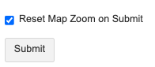

------------------------------------------------------------------------

#### **Example**

To demonstrate this tool, we will analyze the relationship between the area-weighted mean temperature of all upstream habitat and the total area of upstream habitat (ignoring any upstrem culverts):

1.  Select Habitat Quantity Definition as "Area".
2.  Set Plot Type to "Scatterplot".
3.  Choose "Full Temperature (Area)" for the X-axis variable.
4.  Select "Full Habitat (Area)" for the Y-axis.

Adjust the plot's appearance using the jitter sliders to help visualize
dots that are overlaid on top of each other.

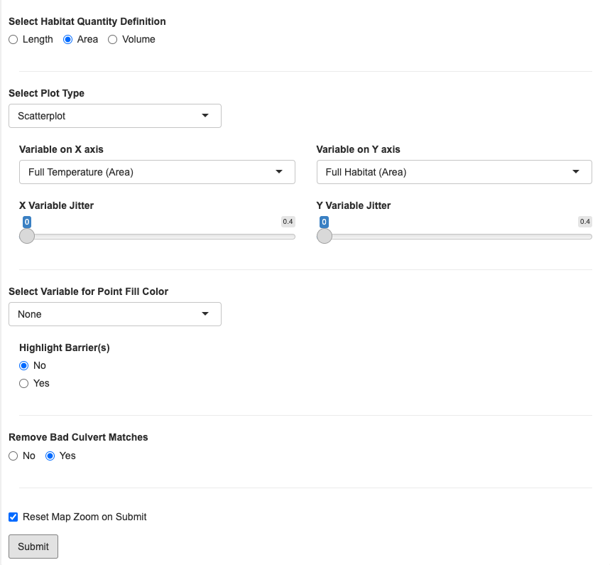

After clicking submit a scatter plot is generated directly under the
interactive map. In this example, we see two groups of culverts with large levels of upstream habitat: a relatively low temperature group and a relatively high temperature group.


Below is an example of adding a color scheme to the scatterplot
by selecting "Full Temperature (Area)" within the Select
Variable for Point Fill Color.

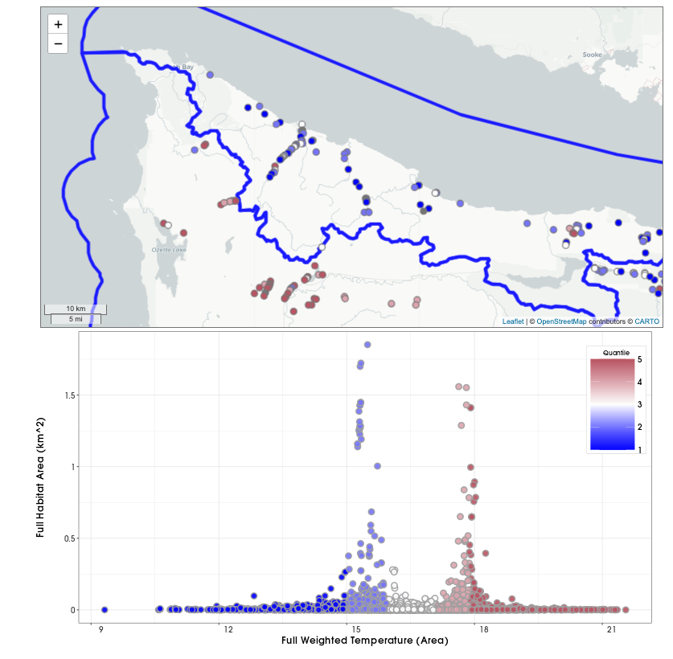

::: columns
::: {.column width="65%"}
If we now refine the area by selecting a specific WRIA (Kennedy - Goldsborough), we can see that the quantile color has shifted in the scatterplot, reflecting temperature ranges within the selected WRIA.
:::

::: {.column width="5%"}
:::

::: {.column width="30%"}

:::
:::

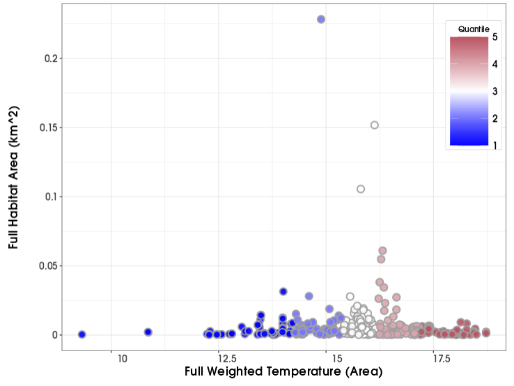

------------------------------------------------------------------------

#### **Highlight Barriers**

The highlight barriers field allows specific culverts to be selected by
their ID from the WDFW barrier inventory. This will highlight them both
on the map as well as in the plot.

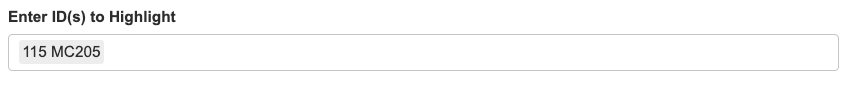

Using the examples in the Kennedy - Goldsborough WRIA, we select 115 MC205 since it is the outlier in terms of Full Habitat (Area). After hitting Submit again, we see this culvert highlighted in both the scatterplot and the interactive map in aqua. 

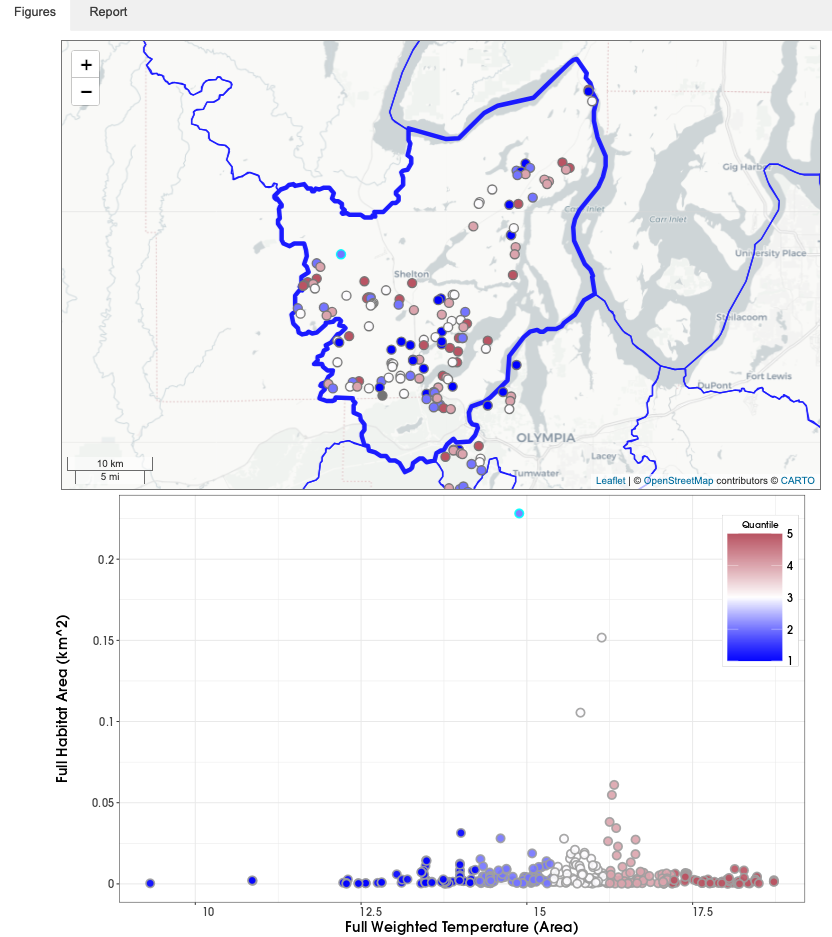{style="width: 70%; display: block; margin-left: auto; margin-right: auto;"}


------------------------------------------------------------------------

::: footer
<a href="https://www.washington.edu/" target="_blank">
 </a>
<a href="https://wsg.washington.edu/" target="_blank">
 </a>
:::

### **Suggest**

#### **Overview**

::: columns
::: {.column width="55%"}
The Suggest feature returns a restoration plan that seeks to maximize return on investments, given your budget, project area and species of interest, and preferences for stream temperatures and habitat type. 

------------------------------------------------------------------------

#### **Getting Started**


To initiate the Suggest feature on the Upstream platform, simply select
your project area of interest, ownership types of interest, define your
objective, and provide a budget. 
:::

::: {.column width="5%"}
:::

::: {.column width="40%"}

:::
:::

------------------------------------------------------------------------

#### **Area, Subarea, and Ownership**

::: columns
::: {.column width="65%"}
In the Suggest feature, refining culverts based on area, subarea, 
ownership, and species sets the benefit of any culvert outside the selection to zero.
Note that a culvert outside the selected area, subarea, ownership type, or species
could still end up in the suggested solution. This will happen if
restoring culverts outside of the selection is required to achieve the
greatest benefit within the selection. The tool will point this out.

*Area*

To refine the inventory data, use the dropdown menu to select Water
Resource Inventory Areas (WRIAs) of interest,
making sure 'All WRIAs' is deselected. 

*Subarea*

The Subarea selector allows for further spatial refinement, based on HUC12(s), and will auto-populate with subareas contained within the selected WRIA(s).

*Ownership*

The Ownership selector filters the culverts based on their ownership as
defined in the WDFW inventory. This includes City, County, Federal,
Private, State, Tribal, Other, Port, Drainage District, Irrigation
District, and Unknown.

\*For example we are choosing the Kennedy - Goldsborough WRIA with all
HUC 12s and all ownership types.
:::

::: {.column width="5%"}
:::

::: {.column width="30%"}

:::
:::

------------------------------------------------------------------------

#### **Select Species of Interest**

Here, you can tailor your results to specific fish species of interest. The species options are derived from the Washington Department of Fish and Wildlife (WDFW) fish passage inventory and include the five Pacific salmon species (Chinook, Coho,
Chum, Pink, and Sockeye) as well as Steelhead. By selecting a species,
you can focus the restoration plan on habitat gains for a particular species.

{style="width: 30%; display: block; margin-left: auto; margin-right: auto;"}

When a species is selected, the results focus on maximizing gains for that species. 
If a culvert does not provide habitat for the selected species, the benefit of 
restoring that culvert is set to zero. 

------------------------------------------------------------------------

#### **Select Projects to Ignore**

::: columns
::: {.column width="55%"}
In addition to spatial and administrative constraints, users can enhance
their Suggest results through providing data and customizing the
objective to be maximized. 

The 'Select Projects to Ignore' field allows users to
input the WDFW site IDs of culverts that have either been recently completed (but
whose corrected status is not yet reflected in the app's data), are
already planned and budgeted for repair separately, or that you believe are incorrectly
matched to a stream in the NHDPlus dataset. 

When you select [a] project(s) to ignore, the analysis will not allocate any of your budget towards them. Instead, it will assume they are already fixed and/or
passable, allowing the tool to allocate your budget to other project alternatives.

The culverts marked as 'Select Projects to Ignore' will be
excluded from the estimated cost and habitat gains of a suggested plan,
but the culvert(s) and its (their) marginal upstream habitat will displayed on the map for informational purposes in a tan color.
:::

::: {.column width="5%"}
:::

::: {.column width="40%"}

:::
:::

Note: If you don't know the culvert's WDFW site id, simply navigate to those points on the map, click, and copy/paste the site id from their call out into the Already Planned / Will Complete field.

Below we can see an example of a solution within the Kennedy - Goldsborough WRIA with a project selected to ignore along with suggested restoration plan (points) in light blue points and estimated habiat gains (lines) in dark blue. Culverts not in the plan, and associated blocked habitat, are displayed in red. 

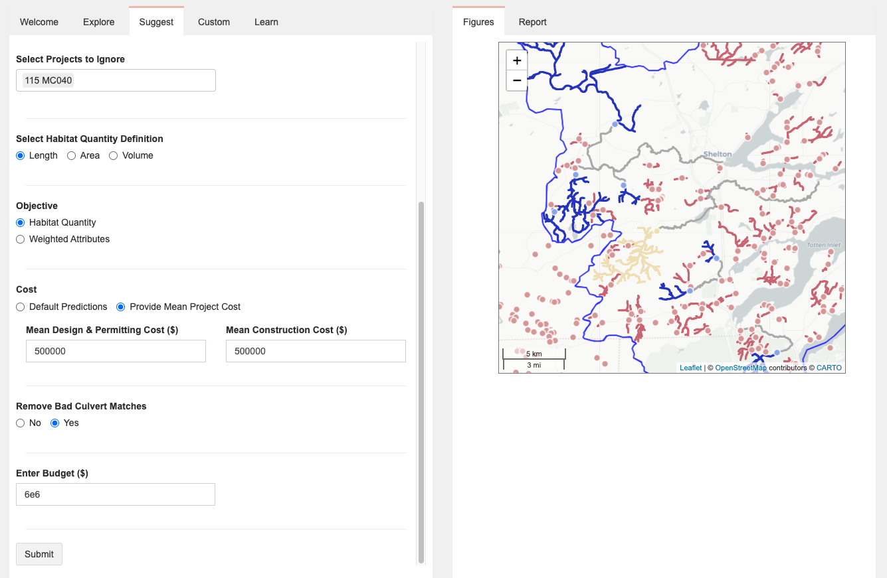


------------------------------------------------------------------------

#### **Habitat Quantity Definition**

Habitat quantity is an important attribute for fish passage planning and
can be quantified in terms of length, area, or volume. By default,
length is used as the primary measure. 

{style="width: 30%; display: block; margin-left: auto; margin-right: auto;"}

*Note:* For area and volume calculations, bankfull width and depth are
utilized as outlined in [Bieger et al.
2015](https://onlinelibrary.wiley.com/doi/abs/10.1111/jawr.12282).

------------------------------------------------------------------------

#### **Objective**

The Objective option in Upstream allows consideration of habitat
quality. When selecting 'Weighted Attributes', the system incorporates
preferences for habitat type and  stream temperature.

First, this option allows you to assign weights to different land use types
within a 100-meter buffer surrounding the streams upstream of a given culvert. These land use categories, derived from the [National Landcover
Dataset](https://www.mrlc.gov/data), include urban, agricultural, and
natural areas. This weighting system enables users to obtain suggested
plans with more or less focus on particular habitat types (e.g. more
weight on natural habitat). Note: Weights must sum to 1.

Additionally, the 'Ideal Habitat Temperature' option allows users to
factor in temperature conditions. For simplicity, August mean temperature is considered as it is a proxy for the max average monthly temperatures anadromous species are
likely to encounter. The temperature values are taken from the NHDplusV2
and have been computed using a grid which combined the
Parameter-elevation Regressions on Independent Slopes Model data
[PRISM](http://www.prismclimate.org) for the period between 1971 and
2000
[Documentation](https://www.epa.gov/system/files/documents/2023-04/NHDPlusV2_User_Guide.pdf).
Missing temperature values were interpolated using **inverse distance
weighting (IDW)** with n.max = 10 while also including bank full width.

It's important to note that temperature will act as a filter in the
analysis. Users can set an ideal temperature range for the selected
species, and the benefits of restoring a culvert will be set to zero
if the temperature is outside this range.


------------------------------------------------------------------------

#### **Cost**

In the Cost option of Suggest, users can provide financial parameters. This feature is
particularly useful for those who have good cost estimates at their
disposal.

-   **Default Modelled Cost Estimates:** For users without specific cost
    data, Upstream offers a default option that utilizes modeled cost
    estimates. These predicted cost were modled from regional data. They only include       construction costs.

Specifically, our default cost estimates were predicted from the model
described in [**Van Deynze et al
2022**](https://www.sciencedirect.com/science/article/abs/pii/S0006320722002634).
As predictions were made in 2019, we have adjusted the predictions for
inflation to the year of the last Upstream release date. Further unknown
costs are spatially interpolated using **inverse distance weighting
(IDW)**.


-   **Provide Mean Project Cost:** Users can modify our default cost
    data in two ways. First, users can enter a design cost. Because our
    default cost estimates do not include design cost, the user-provided
    design costs will be added to our cost estimates.

Second, users can provide a mean construction costs, which will be used
to rescale our cost estimates multiplicatively. For example, if the
user-provided mean cost is twice as much as the mean of our cost
estimate, for the entire Case Area, our cost estimates will be multiplied
by 2.

------------------------------------------------------------------------

#### **Remove Bad Matches**

The default selection is to filter out bad matches, however, in the user can choose to include bad matches in the data used to generate plots. Bad matches are those that were identified as not likely associated with a streamline in the NHDPlus HR dataset. More info can be found in the Learn section of this manual. 


------------------------------------------------------------------------

#### **Enter Budget**

::: columns
::: {.column width="55%"}
Users must provide a budget in US dollars---such as 800000 in the
example to the right. Scientific notation can also be used, e.g., 60 million
dollars can be written as 60e6.

Note that the suggested solution will not exceed the provided budget.
Therefore, it is important to check whether the solution is
substantially changed by adding small amounts to the provided budget.
:::

::: {.column width="5%"}
:::

::: {.column width="40%"}

:::
:::

------------------------------------------------------------------------

#### **Submit**

Without additional selections (see below), clicking "Submit" will
provide two products:

1.  A map highlighting, in light blue, barrier(s) that are estimated to unlock
    the most habitat for the user defined budget. This is an example solution within the Kennedy - Goldsborough WRIA.

<p align="center">


</p>

2.  A report, on the suggested projects in the plan, providing
    total estimated habitat gains, by fish species (if known) and habitat type, 
    along a list of barriers in the plan and their cost estimate (reflecting user           modifications).

<p align="center">


</p>

------------------------------------------------------------------------

#### **Example**

Now let's consider prioritizing Coho habitat adjusting the Mean Design & Permitting Cost and the Mean Construction Cost to $500,000. We will also consider a budget of 6 million, or 6e6, within the Kennedy - Goldsborough WRIA for all ownership types. 

<p align="center">

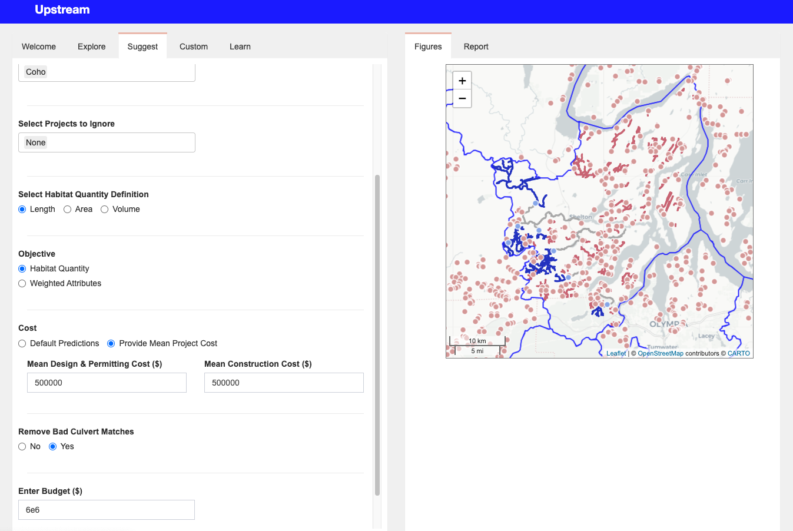

</p>

In the map generated from this request, we see that overall habitat length gained by this solution as shown by the dark blue lines. To see the details associated with the individual projects, we can view the Report tab.

<p align="center">

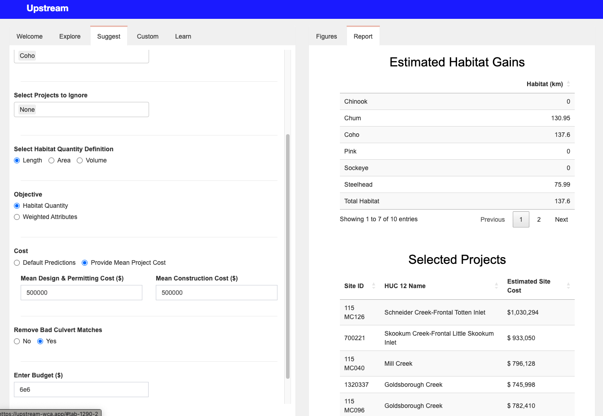

</p>

If we then consider solutions that only place value on agricultural and natural surrounding landscape types, and those with upstream temperatures below 17 degrees Celsius, we can do so by adjusting the Objectives inputs. Note: Here we set urban land cover to 0, therefore the other two land type weights must equal 1. We evenly weigh them as 0.5 and 0.5. We also adjust the slider bar such that 17 is the maximum value in 
the temperature range.

<p align="center">

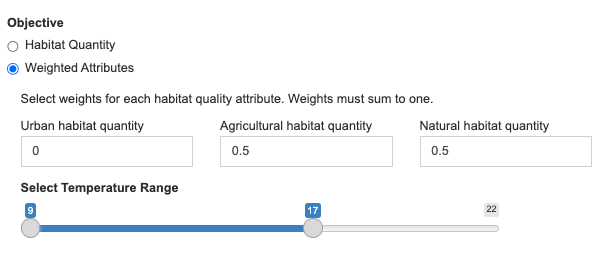

</p>

We now see that with those constraints much less habitat overall is open up and can find more details within the report. 

<p align="center">

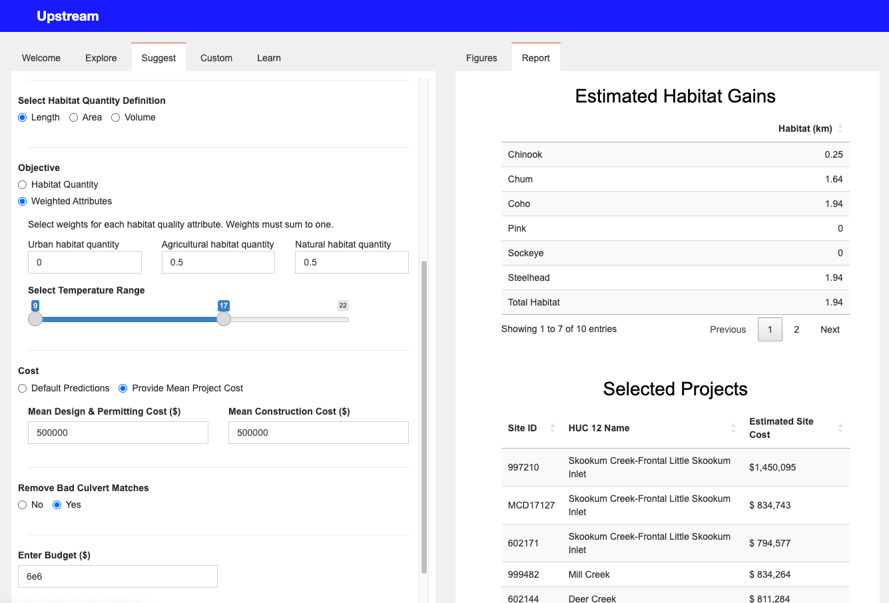

</p>

------------------------------------------------------------------------

::: footer
<a href="https://www.washington.edu/" target="_blank">
 </a>
<a href="https://wsg.washington.edu/" target="_blank">
 </a>
:::

### **Custom**

#### **Overview**

::: columns
::: {.column width="55%"}
The Custom feature in Upstream allows users to explore the results from a customized 
portfolio of barrier corrections. 
    
------------------------------------------------------------------------

#### **Getting Started**

To use Custom, start by choosing your project area, budget, and culvert
ownership types, similar to the Suggest feature. The unique aspect here
is the ability to select culverts to include in a restoration plan, 
by their WDFW site IDs. The Custom feature then generates a map and report detailing habitat gains from the customized plan, by salmon species and habitat type, along with the estimated cost of the plan.
:::

::: {.column width="5%"}
:::

::: {.column width="40%"}

:::
:::

------------------------------------------------------------------------

#### **Area, Subarea, and Ownership**

::: columns
::: {.column width="65%"}
As in the Explore and Suggest feature, we can refine culverts based on Area, Subarea, and Ownership to filter out the culvert site IDs of interest, which then become
project alternatives for your customized plan.

*Area*

To refine the inventory data, use the dropdown menu to select Water
Resource Inventory Areas (WRIAs) of interest,
making sure 'All WRIAs' is deselected. 

*Subarea*

The Subarea selector allows for further spatial refinement, based on HUC12(s), and will auto-populate with subareas contained within the selected WRIA(s).

*Ownership*

The Ownership selector filters the culverts based on their ownership as
defined in the WDFW inventory. This includes City, County, Federal,
Private, State, Tribal, Other, Port, Drainage District, Irrigation
District, and Unknown.

:::

::: {.column width="5%"}
:::

::: {.column width="30%"}

:::
:::

------------------------------------------------------------------------

#### **Habitat Quantity Definition**

As in the other features, habitat quantity can be quantified in terms of length, area, or volume. By default, length is used as the primary measure.

{style="width: 30%; display: block; margin-left: auto; margin-right: auto;"}

*Note:* For area and volume calculations, bankfull width and depth are
utilized as outlined in [Bieger et al.
2015](https://onlinelibrary.wiley.com/doi/abs/10.1111/jawr.12282).

------------------------------------------------------------------------

#### **Cost**

In the Cost option of Custom, users can provide financial parameters. This feature is
particularly useful for those who have good cost estimates at their
disposal.

-   **Default Modelled Cost Estimates:** For users without specific cost
    data, Upstream offers a default option that utilizes modeled cost
    estimates. These predicted cost were modled from regional data. They only include       construction costs.

Specifically, our default cost estimates were predicted from the model
described in [**Van Deynze et al
2022**](https://www.sciencedirect.com/science/article/abs/pii/S0006320722002634).
As predictions were made in 2019, we have adjusted the predictions for
inflation to the year of the last Upstream release date. Further unknown
costs are spatially interpolated using **inverse distance weighting
(IDW)**.


-   **Provide Mean Project Cost:** Users can modify our default cost
    data in two ways. First, users can enter a design cost. Because our
    default cost estimates do not include design cost, the user-provided
    design costs will be added to our cost estimates.

Second, users can provide a mean construction costs, which will be used
to rescale our cost estimates multiplicatively. For example, if the
user-provided mean cost is twice as much as the mean of our cost
estimate for the entire case area, our cost estimates will be multiplied
by 2.

------------------------------------------------------------------------

#### **Select Projects to Ignore**

::: columns
::: {.column width="55%"}
As in Suggest, the 'Select Projects to Ignore' field allows users to
input the WDFW site IDs of culverts that have either been recently completed (but
whose corrected status is not yet reflected in the app's data), are
already planned and budgeted for repair separately, or that you believe are incorrectly
matched to a stream in the NHDPlus dataset. 

When you select [a] project(s) to ignore, the analysis will not allocate any of your budget towards them. Instead, it will assume they are already fixed and/or
passable, allowing the tool to allocate your budget to other project alternatives.

The culverts marked as 'Select Projects to Ignore' will be
excluded from the estimated cost and habitat gains of a suggested plan,
but the culvert(s) and its (their) marginal upstream habitat will displayed on the map for informational purposes in a tan color.
:::

::: {.column width="5%"}
:::

::: {.column width="40%"}

:::
:::

------------------------------------------------------------------------

#### **Enter ID(s) for Your Custom Plan**

This is the field that allows you to enter culvert site IDs to be included in your
customized plan. If you provided any constraints in the above fields, the culvert IDs will reflect them. Note: You must provide at least 1 culvert ID to generate an output within the Custom feature. 

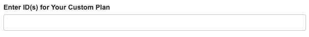

------------------------------------------------------------------------

#### **Remove Bad Matches**

The default selection is to filter out bad matches, however, in the user can choose to include bad matches in the data used to generate plots. Bad matches are those that were identified as not likely associated with a streamline in the NHDPlus HR dataset. More info can be found in the Learn section of this manual. 


------------------------------------------------------------------------

#### **Demo**

Like in the Explore and Suggest tabs, we will use Kennedy - Goldsborough
as our selected area considering all HUC 12s and ownership types. We will define a Mean Design & Permitting Cost and a Mean Construction Cost of $500,000 and the ID for the culvert will be 115 MC097, which we enter in the Enter ID(s) for Your Custom Plan field. 

<p align="center">

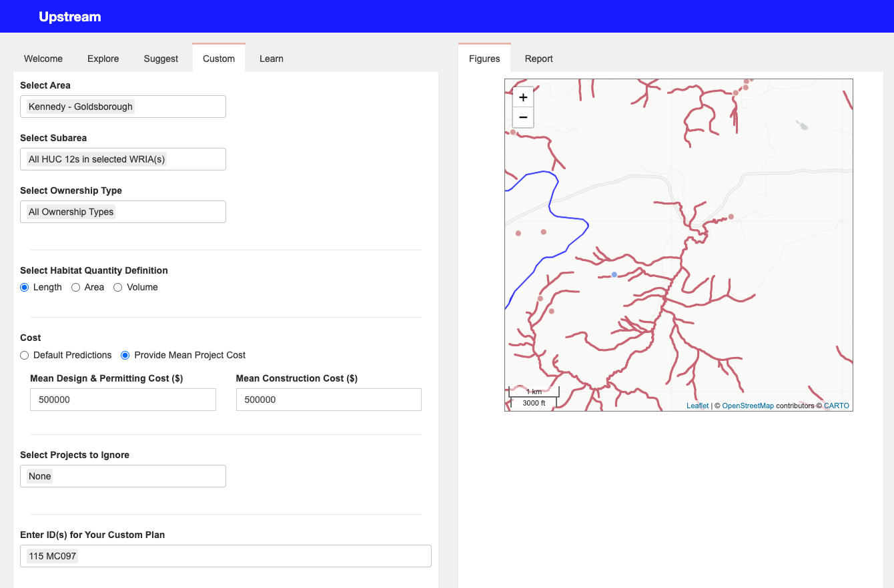

</p>

We now generate a map when we click submit that highlights our planned
culvert in blue showing their location. The habitat that unlocked by the plan will
be shown in dark blue. Since there is a downstream barrier, none of the stream lines above the selected culvert appear in dark blue.

However, if we know that the downstream culvert is already being corrected and will not need to be funded directly by our project, we can add it to the Select Projects to Ignore field. In this example, we will add 115 MC040 to the Select Projects to Ignore. Now we see that the habitat above our culvert is now considered to be unlocked by the plan (shown in dark blue) by being marked blue, with the stream lines blocked by our ignored project displayed in a tan color. 

<p align="center">

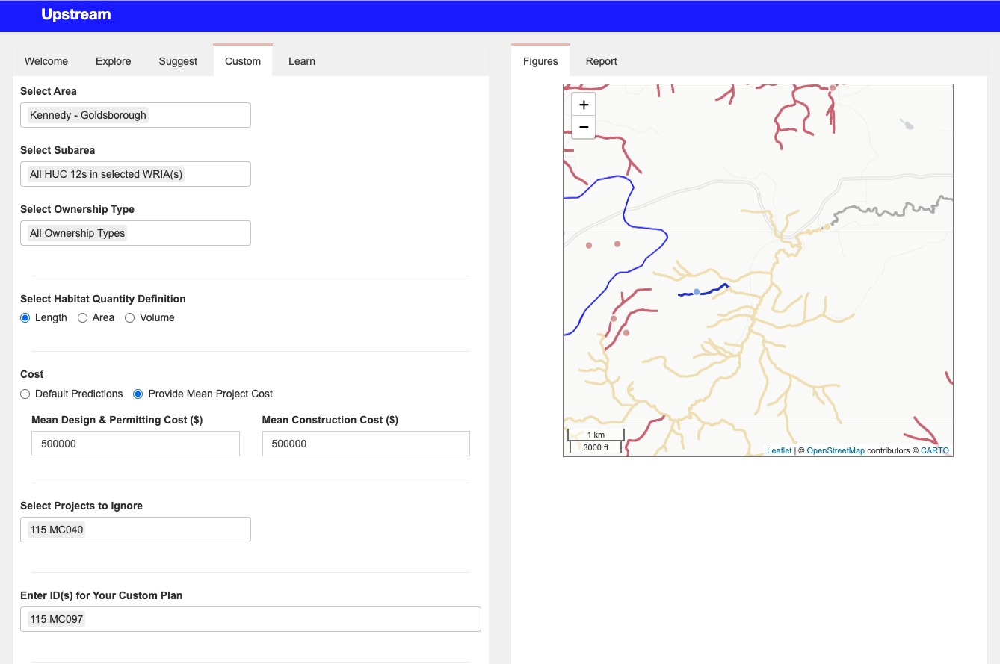

</p>

------------------------------------------------------------------------

::: footer
<a href="https://www.washington.edu/" target="_blank">
 </a>
<a href="https://wsg.washington.edu/" target="_blank">
 </a>
:::

### **Learn**

#### **Overview**

::: columns
::: {.column width="55%"}
The Learn feature contains links to this manual as well as additional
information about the app. In addition to this user manual, you can view the recording of the [Upstream launch webinar](https://vimeo.com/907552408?share=copy). 

:::

::: {.column width="5%"}
:::

::: {.column width="40%"}

:::
:::

------------------------------------------------------------------------

#### **Get in Touch**

We would love to hear from you. Please reach out with questions or suggestions.

You can also report issues to help improve Upstream. To do so, you can email the project team directly using the Contact Us button on the Welcome tab of this manual, or visit [GitHub Issues](https://github.com/sljardine/upstream/issues) page to report the issue. You will need to create a GitHub account, but this platform can be used to track bugs in the software along with their fixes.

------------------------------------------------------------------------

#### **Development Process**

The concept for Upstream was developed by a team of researchers at the University of Washington, the Northwest Fisheries Science Center, the United States Geological Survey, and the Washington Department of Fish and Wildlife.

Our team was guided by a Scientific Advisory Committee including members from the
Washington Department of Fish and Wildlife, the Squaxin Island Tribe, the Tulalip Tribes, and King, Pierce, Snohomish, and Whatcom counties.

Additionally, during the development process we received public input at a virtual
workshop held in June of 2022.

------------------------------------------------------------------------

#### **Core Project Team**

-   Sunny Jardine (Project lead, Lead developer)

-   Robby Fonner (Project advisor)

-   Dan Holland (Project advisor)

-   Mark Scheuerell (Project advisor)

-   Braeden Van Deynze (Project advisor)

-   Connor Lewis Smith (Developer, IT)

-   Jeffery Comnick (Developer)

-   Logan Blair (Developer)

-   J Kahn (Developer)

-   Zephyr Pfotenhauer (Illustrator)


------------------------------------------------------------------------

::: footer
<a href="https://www.washington.edu/" target="_blank">
 </a>
<a href="https://wsg.washington.edu/" target="_blank">
 </a>
:::

### **Data and Resources**

#### **Overview**

Upstream utilizes a variety of data sources to provide accurate and
up-to-date information. Below is a list of these sources, detailing
their specific contributions to our app.

------------------------------------------------------------------------

#### **Key Data Inputs**

Our analysis draws from four primary datasets: the [United States Geological Survey's (USGS) National Hydrography Dataset plus attributes (NHDPlus) in high resolution (NHDPlus HR)](https://www.usgs.gov/national-hydrography/nhdplus-high-resolution), the [USGS NHDPlus Version 2 (NHD V2)](https://www.epa.gov/waterdata/get-nhdplus-national-hydrography-dataset-plus-data), the [Washington Department of Fish and Wildlife's Fish Passage Barriers Inventory](https://wdfw.wa.gov/species-habitats/habitat-recovery/fish-passage/assessment), and the [National Land Cover Database (NLCD)](https://www.mrlc.gov/data/nlcd-2021-land-cover-conus). From these datasets, we calculate the total length (km), area (km^2), and volume (km^3) of habitat upstream of each barrier, the habitat quantity from each barrier to the next upstream barrier(s), the quantity-weighted mean August stream temperature, and land cover within a 100 meter buffer of the upstream NHDPlus HR streams, classified as natural, agriculture, and urban. More information about these datasets, and their use in Upstream, is provided in the list below.

**Culvert (Points) Data**

::: columns
::: {.column width="55%"}
1.  [**WDFW Barrier
    Inventory**](https://fortress.wa.gov/dfw/public/PublicDownload/habitat/FishPassage/)**:**

    -   **Last updated for app use:** 9/1/23.

    -   **Removal of natural barriers and barriers upstream of natural
        barriers:** This dataset has been refined to exclude natural
        barriers, focusing solely on man-made obstructions to provide a
        more targeted approach for restoration and management efforts.

    -   **Comprehensive Data Collection:** Includes detailed information
        on the location, type, and status of each man-made barrier,
        aiding in effective planning and prioritization.

    -   **Additional details and web maps available
        [here](https://wdfw.wa.gov/species-habitats/habitat-recovery/fish-passage/assessment):**
        Offers an interactive way to explore and understand the data,
        enhancing user engagement and comprehension.
:::

::: {.column width="5%"}
:::

::: {.column width="40%"}
<a href="https://wdfw.wa.gov/species-habitats/habitat-recovery/fish-passage/assessment" target="_blank">

</a>
:::
:::

::: columns
::: {.column width="55%"}
2.  [**WSDOT Planned and Corrected Barrier
    Inventories**](https://gisdata-wsdot.opendata.arcgis.com/search?q=fish%20passage)**:**

    -   **Includes Fish Passage Delivery Plan Sites for 2021-2023,
        2023-2025, and 2025-2027:** Provides a forward-looking view of
        planned restoration activities, helping users to align their
        projects with state initiatives.

    -   **Statewide data on corrected barriers:** This dataset offers
        insights into the progress made in barrier correction, serving
        as a benchmark for future projects.

    -   **Accessible and User-Friendly Data:** The dataset is available
        in a user-friendly format, making it easier for practitioners
        and researchers to analyze and utilize.

    -   **Explore the dataset
        [here](https://gisdata-wsdot.opendata.arcgis.com/datasets/WSDOT::wsdot-fish-passage-corrected-barriers-statewide/explore):**
        Direct link to the dataset for in-depth exploration and
        analysis.
:::

::: {.column width="5%"}
:::

::: {.column width="40%"}
<a href="https://gisdata-wsdot.opendata.arcgis.com/search?q=fish%20passage" target="_blank">

</a>
:::
:::


**Streams (Lines) Data**

::: columns
::: {.column width="55%"}
1.  [**NHDPlus
    HR**](https://www.usgs.gov/national-hydrography/nhdplus-high-resolution)**:**

    -   NHDPlus HR is a comprehensive set of digital spatial data that
        includes high-resolution flowline networks, catchment areas, and
        watershed boundaries (WBD HUC). It represents a significant
        advancement in the mapping and management of water features
        across the United States.

    -   This dataset is crucial for hydrological analysis, environmental
        planning, and resource management. It provides detailed
        information about stream networks, including their flow
        direction and connectivity.

    -   Data for this project is acquired using
        [nhdplusTools](https://doi-usgs.github.io/nhdplusTools/), a
        suite of tools designed to facilitate the use and analysis of
        NHDPlus data. These tools help in extracting, processing, and
        visualizing hydrographic data effectively.
:::

::: {.column width="5%"}
:::

::: {.column width="40%"}
<a href="https://doi-usgs.github.io/nhdplusTools/" target="_blank">

</a>
:::
:::


**Temperature and Land Use Data**

::: columns
::: {.column width="55%"}
1.   Temperature data utilized in our application are derived from the
    NHDPlusV2 dataset as the August Mean Temperatures in Celsius. The
    choice of August data is strategic, as it likely represents the
    maximum average monthly temperatures that anadromous species might
    encounter. These temperature values are sourced from the PRISM
    Climate Group
    ([\<http://www.prismclimate.org>](http://www.prismclimate.org/)) for
    the period spanning 1971 to 2000. For a comprehensive understanding
    of the attributes in NHDPlusV2, please refer to the [NHDPlusV2 User
    Guide](https://www.epa.gov/system/files/documents/2023-04/NHDPlusV2_User_Guide.pdf).
    In cases where temperature data were missing, we applied Inverse
    Distance Weighting (IDW) interpolation, with a maximum neighbor
    count of 10, incorporating the bankfull width of water bodies.

2.   Land use data is derived from the [National Landcover
    Dataset](https://www.mrlc.gov/data), specifically the 2021 version,
    offering insights into the surrounding environments of habitats.
    These land types, following the [Anderson Land Cover Classification
    System](https://pubs.usgs.gov/pp/0964/report.pdf) are further
    simplified assigning classes 81 and 82 to "agriculture" and classes
    21, 22, 23 and 24 to "urban". All remaining classes then become
    categorized as "natural".
:::

::: {.column width="5%"}
:::

::: {.column width="40%"}
<html>

<head>

```{=html}
<script>
        function showImage() {
            var popup = window.open("", "Image", "width=400,height=300");
            var img = document.createElement("img");
            img.src = "images/NLCD_Colour_Classification_Update.jpg";
            img.style.maxWidth = '100%';
            img.style.height = 'auto';
            img.style.display = 'block';
            img.style.marginLeft = 'auto';
            img.style.marginRight = 'auto';

            var closeButton = document.createElement("button");
            closeButton.textContent = "Close";
            closeButton.onclick = function() {
                popup.close();
            };

            popup.document.body.appendChild(img);
            popup.document.body.appendChild(closeButton);
        }
    </script>
```
</head>

<body>


</body>

</html>
:::
:::


**Cost Estimates**

-   [**Van Deynze et al
    2022**](https://www.sciencedirect.com/science/article/abs/pii/S0006320722002634)**:**

    -   Provides modelled cost estimates for project planning. These
        costs were originally estimated in 2019 USD, however, costs are
        adjusted for inflation during the data compilation process.


**Legal Boundaries**

::: columns
::: {.column width="35%"}
-   [**Injunction
    Boundary**](https://geo.wa.gov/datasets/fe5bc6ad319144478326336b04ab619f/about)**:**

    -   Outlines the case area for U.S. District Court Injunction No.
        C70-9213.
:::

::: {.column width="5%"}
:::

::: {.column width="60%"}

:::
:::

------------------------------------------------------------------------

#### **Bad Matches**

The primary hydrography layer in Upstream is the [USGS NHDPlus HR dataset](https://www.usgs.gov/national-hydrography/nhdplus-high-resolution), which is
the most detailed national hydrography layer. However, some culverts are not well matched to stream lines in the NHDPlus HR dataset. This is a challenge, as bad matches
will affect our estimates of habitat quantity and connectivity between culverts in the sytem. 

In an attempt to address bad matches, we developed an auxillary predictive model to determine whether a barrier is a ``good match'' to its closest NHDPlus HR stream.

In addition to the key data inputs described above, we utlized data on lidar-derived streamlines, generated from the [USGS 10 meter digital elevation model dataset](https://data.usgs.gov/datacatalog/data/USGS:3a81321b-c153-416f-98b7-cc8e5f0e17c3) and a geospatial roads layer.

With these inputs, we assemble a dataset for each barrier including measures of distances and directions to the nearest streams and roads, the similarities of these distances and directions, estimates of the similarity of the NHDPlus HR and lidar stream locations, whether or not stream names in the WDFW inventory are the same as the stream name from the NHDPlus HR dataset, total culvert cross-sectional area, scraped from WDFW's culvert reports, and stream flow rates from the matched NHDPlus HR stream segment.

We then construct a random forest model to predict whether or not each culvert is a good match to its closest NHDPlus HR dataset stream. The random forest model was trained by manually classifying a randomly selected subset of 301 culverts. The model F1-Scores for the validation data were 0.91 for good matches, and 0.94 for bad matches. The model classifies 73.5% of barriers as well matched to their NHDPlus HR stream line, which we include in this analysis.

Read more here: [View PDF](CulvertClassificationRandomForestModel_20240119_NRSIG.pdf)

Future work matching barrier culverts to a networked hydrography layer is important for fish passage planning in Washington.


------------------------------------------------------------------------

#### **Additional Resources**

In the realm of fish barrier culvert management and prioritization, a
wealth of resources and methodologies exist to guide decision-making
processes. Two key resources provide invaluable insights into these
practices:

1.  **WDFW Fish Passage Inventory, Assessment, and Prioritization
    Manual**: This comprehensive manual, developed by the Washington
    Department of Fish and Wildlife (WDFW), outlines detailed schemes
    for prioritizing fish barrier culverts. It serves as a critical
    guide for understanding the criteria and processes involved in
    assessing and prioritizing culvert projects for fish passage
    restoration. The manual can be accessed
    [here](https://wdfw.wa.gov/sites/default/files/publications/02061/Fish%20Passage%20Inventory%2C%20Assessment%2C%20and%20Prioritization%20Manual.pdf).
    It is an essential read for anyone involved in fish passage
    improvement projects, offering a structured approach to prioritizing
    interventions based on ecological and logistical considerations.

2.  **Approaches to Prioritization in the Case Area**: A manuscript
    available on bioRxiv
    [here](https://www.biorxiv.org/content/10.1101/2022.11.07.515553v1)
    provides a detailed analysis of different entities' approaches to
    prioritization within the case area. This paper offers a comparative
    perspective, highlighting the diverse methodologies and strategies
    employed by various organizations in addressing fish passage
    barriers.


------------------------------------------------------------------------

#### **App Development and Source Code**

::: columns
::: {.column width="7%"}
<a href="https://thinkr-open.github.io/golem/" target="_blank">

</a>
:::

::: {.column width="3%"}
:::

::: {.column width="90%"}
**Golem Framework:** The Upstream app was developed using the
[Golem](https://thinkr-open.github.io/golem/) Shiny application
framework. Golem provides a structured and efficient approach for
building complex Shiny applications, enhancing maintainability and
scalability.
:::
:::

::: columns
::: {.column width="7%"}
<a href="https://github.com/" target="_blank">

</a>
:::

::: {.column width="3%"}
:::

::: {.column width="90%"}
**Source Code on GitHub:** The source code for Upstream is available on
[GitHub](https://github.com/), promoting transparency and collaboration
within the community. This open-source approach allows users to review,
contribute, or adapt the code for their own projects.
:::
:::

------------------------------------------------------------------------

::: footer
<a href="https://www.washington.edu/" target="_blank">
 </a>
<a href="https://wsg.washington.edu/" target="_blank">
 </a>
:::
