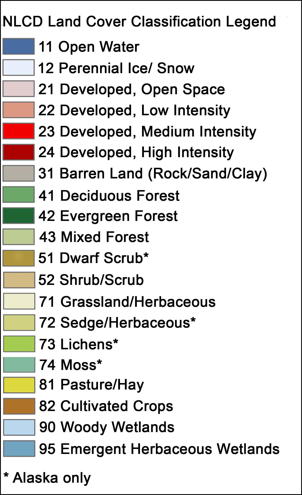
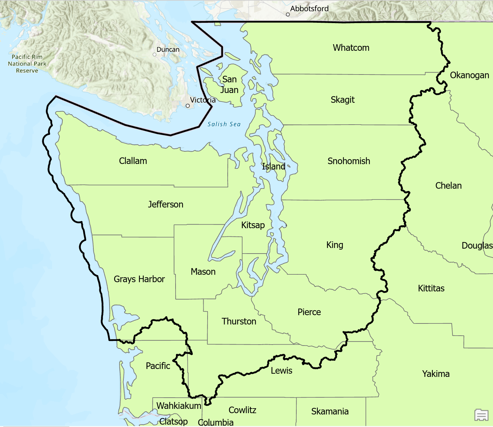

```{=html}
<style>
.footer {
  text-align: right;
  padding: 10px;
}
.footer img {
  width: 50px; /* Adjust as needed */
  height: auto;
  margin-left: 10px;
}
</style>
```
```{r setup, include = FALSE}
```

##  {.tabset}

### **Welcome**

::: columns
::: {.column width="55%"}
#### **Summary**

Welcome to the Upstream User Guide! [Upstream](https://upstream-cloud-run-jcypjvvn7a-uw.a.run.app) is an intuitive and user-friendly R Shiny application designed for barrier culvert restoration planning in Western Washington. This guide serves as both a technical manual and a comprehensive overview of the app's functionalities, including its core features: Explore, Suggest, Custom, and Learn.

Upstream is more than just a tool; it's a solution crafted to simplify complex planning processes in environmental restoration. Whether you're a seasoned expert or new to the field of barrier culvert restoration, this guide will help you harness the full potential of Upstream.

In this guide, you'll find detailed explanations of each feature:

-   *Explore:* Delve into data and visualize culvert attributes across various boundaries.

-   *Suggest:* Receive tailored restoration plans based on your specific constraints and budget.

-   *Custom:* Create and assess the impact of your own set of restoration projects.

-   *Learn:* Learn about how to utilize the app its development.

Our aim is to provide you with all the information you need to make informed decisions and streamline your planning process. With helpful tips, step-by-step instructions, and links to related resources, this guide is your comprehensive companion in utilizing Upstream effectively.

To get started, select a tab above for detailed insights into each of Upstream's unique features. Dive in and discover how Upstream can enhance your restoration planning experience!
:::

::: {.column width="5%"}
:::

::: {.column width="40%"}
<html>
<head>
    <style>
        #tooltip {
            display: none;
            position: absolute;
            background-color: #f9f9f9;
            border: 1px solid #d4d4d4;
            border-radius: 4px;
            padding: 16px;
            color: black;
            font-size: 14px;
            font-family: Arial, sans-serif;
            z-index: 1000;
        }
    </style>
</head>
<body>
    <div id="tooltip">Static view of interactive map tool</div>
     <!-- Increased image size -->

    <script>
        var tooltip = document.getElementById("tooltip");
        var mapImage = document.getElementById("mapImage");

        mapImage.addEventListener("mousemove", function(e) {
            tooltip.style.display = "block";
            tooltip.style.left = e.pageX + 10 + 'px';
            tooltip.style.top = e.pageY + 10 + 'px';
        });

        mapImage.addEventListener("mouseout", function() {
            tooltip.style.display = "none";
        });
    </script>
</body>
</html>


:::
:::

------------------------------------------------------------------------

#### **Looking for Additional Information?**

::: columns
::: {.column width="80%"}
If you require more details or have specific questions, we're here to help. Feel free to reach out to us for further assistance or any queries you might have.
:::

::: {.column width="5%"}
:::

::: {.column width="15%"}
<a href="mailto:jardine@uw.edu" style="background-color: #0044cc; color: white; padding: 10px 20px; text-align: center; text-decoration: none; display: inline-block; border-radius: 5px; font-weight: bold;">Contact Us</a>
:::
:::

---

::: footer
<a href="https://www.washington.edu/" target="_blank">
    
</a>
<a href="https://wsg.washington.edu/" target="_blank">
    
</a>
:::

### **Explore**

#### **Overview**

::: columns
::: {.column width="55%"}
The Explore feature is designed to visualize and plot culvert attributes across various administrative and hydrological boundaries.

------------------------------------------------------------------------

#### **Getting Started**

Choose the 'Explore' tile on the Upstream landing page or select the corresponding tab. This feature automatically shows the entire WDFW culvert inventory for western Washington, updated to the latest version in Upstream. It filters out natural barriers and any barriers situated upstream of natural barriers.
:::

::: {.column width="5%"}
:::

::: {.column width="40%"}

:::
:::

------------------------------------------------------------------------

#### **Interactive Map**

::: columns
::: {.column width="55%"}
The interactive map in the Explore feature is a key component for visualizing culvert data. Here's how to navigate and use it:

-   **Zoom for Details:** At higher zoom levels, the map displays counts of culverts to manage the density of information. As you zoom in, individual culverts are revealed, allowing for more detailed examination.

-   **Click for Information:** Clicking on a culvert once it's visible on the map brings up a callout with crucial details such as Site ID, passability, potential fish species, and estimated construction cost.

-   **Filtering for Focus:** Utilize the dropdown menus to select specific Water Resource Inventory Areas (WRIAs) and ownership types. This tailors the map to show only the data relevant to your area of interest.

This interactive map is designed to be user-friendly, providing an effective tool for analyzing culvert data and aiding in your restoration planning.
:::

::: {.column width="5%"}
:::

::: {.column width="40%"}

:::
:::

------------------------------------------------------------------------

#### **Map Call-Outs**

::: columns
::: {.column width="55%"}
Zoom into your area of interest and click on a culvert to access detailed information. The callouts provide insights into:

-   The culverts Site ID
-   Passability
-   Potential Fish Species
-   Total Upstream Habitat
-   Habitat to next barrier (marginal)
-   Estimated Construction Cost
-   Ownership
-   The number of culverts corrected downstream by WSDOT
-   The number of culverts corrected downstream by other than WSDOT
-   Weather WSDOT Plans to correct that particular barrier
-   The date the culvert was surveyed
:::

::: {.column width="5%"}
:::

::: {.column width="40%"}

:::
:::

------------------------------------------------------------------------

#### **Area, Subarea, and Ownership**

::: columns
::: {.column width="55%"}
To refine the inventory data, use the dropdown menu to select Water Resource Inventory Areas (WRIAs) of interest. For multiple selections, ensure 'All WRIAs' is deselected. Similarly, selecting specific ownership types will filter the maps and figures accordingly.
:::

::: {.column width="5%"}
:::

::: {.column width="40%"}

:::
:::

------------------------------------------------------------------------

#### **Select Variables For Plotting**

This section allows you to plot variables as a histogram or scatterplot. For instance, to analyze the relationship between the cost of culvert repairs and the length of blocked habitat:

1.  Set Plot Type to "Scatterplot".
2.  Choose "Cost" for the X-axis variable.
3.  Select "Full Habitat Length" for the Y-axis.
4.  For style, use "Cost" as the fill color.

Adjust the plot's appearance using the jitter sliders.


------------------------------------------------------------------------

#### **Submit and Visualization**

::: columns
::: {.column width="35%"}
Click "Submit" to generate two outputs:

1.  An interactive map showcasing culverts within the selected area, subarea, and ownership.
2.  A scatter plot illustrating the chosen characteristics.

Note: The 'Select Variable for Map' and 'Plot Fill Color' options enhance the visualization of the selected variable on both the map and scatter plot.
:::

::: {.column width="5%"}
:::

::: {.column width="60%"}

:::
:::

------------------------------------------------------------------------

::: footer
<a href="https://www.washington.edu/" target="_blank">
    
</a>
<a href="https://wsg.washington.edu/" target="_blank">
    
</a>
:::

### **Suggest**

#### **Overview**

::: columns
::: {.column width="55%"}
The Suggest feature returns a restoration plan that maximizes habitat, given the users budget, project area, and other constraints.

------------------------------------------------------------------------

#### **Getting Started**

To initiate the Suggest feature on the Upstream platform, simply select your project area, define your budget, and choose the culvert ownership types. This process, accessible in the Suggest section, is straightforward and user-friendly, allowing you to quickly set the parameters for your habitat restoration plan.
:::

::: {.column width="5%"}
:::

::: {.column width="40%"}

:::
:::

------------------------------------------------------------------------

#### **Enter Budget**

::: columns
::: {.column width="55%"}
As with Upstream's Explore feature, WRIA's, sub-areas, and ownership type can be customized in Suggest to meet the needs of the user through a series of drop-down menus (see "Explore" tab section for more on this). For example, on the right we allow for Upstream to suggest culverts of all ownership types in all sub-areas within the Chambers-Clover WRIA only.

Once an these fields are populated, provide the budget available for repairs in US dollars---such as 80000 in the example to the right.
:::

::: {.column width="5%"}
:::

::: {.column width="40%"}

:::
:::

------------------------------------------------------------------------

#### **Submit**

Without additional selections (see below), clicking "Submit" will provide two products:

1.  A map highlighting, in blue, barrier(s) that are estimated to unlock the most habitat for the user defined budget. selections here are based on [Recent research](https://www.sciencedirect.com/science/article/abs/pii/S0006320722002634) on regional repair costs, and uniform habitat quality.

<p align="center">


</p>

2.  A report, matching projects on the map, that provides the summed habitat by fish species (if known), that is estimated to be repaired, along with estimated cost per barrier id within the plan.

<p align="center">


</p>

------------------------------------------------------------------------

#### **Already Planned / Will Complete**

::: columns
::: {.column width="55%"}
In addition to spatial and administrative constraints, users can pass new information and customization to their Suggest analysis. The Already Planned / Will Complete field allows users to include the IDs of culverts they have either recently completed (but passibility is not reflected in the apps data), or have planned and budgeted for those repairs separately. In either case, including the culvert will remove the cost of its repair in the analysis, assume it is now passable, and suggest additional barriers within the users budget as before. Additionally, the added Planned/Completed culverts will be shown as associated habitat in the map but ignored in the new report.
:::

::: {.column width="5%"}
:::

::: {.column width="40%"}

:::
:::

Note: If you don't know the culvert id, but know their physical locations, simply navigate to those points on the map, click, and copy/paste the id from their call out into the Already Planned / Will Complete field.Once added, click the submit button again.

------------------------------------------------------------------------

#### **Example Results**

::: columns
::: {.column width="55%"}
Map Results:

Including the two culverts to the southwest as already planned / completed, and leaving budget the same, suggests a new third culvert to the northeast, the map indicates potential habitat gains in blue with areas that will remain blocked in red.
:::

::: {.column width="5%"}
:::

::: {.column width="40%"}

:::
:::

Report Results:

Only the unlocked habitat and cost of the new suggestion is given. Note that this particular stream had no species listed, but still reports the total linial gain.


------------------------------------------------------------------------

#### **Habitat Quantity Definition**

Habitat quantity is a critical metric in environmental assessment and can be quantified in terms of length, area, or volume. By default, length is used as the primary measure.


*Note:* For area and volume calculations, bankfull width and depth are utilized as outlined in [Bieger et al. 2015](https://onlinelibrary.wiley.com/doi/abs/10.1111/jawr.12282).

------------------------------------------------------------------------

#### **Objective**

The Objective feature in Upstream provides a more comprehensive analysis of habitat quality. When selecting 'Weighted Attributes', the system incorporates various habitat quality metrics, building upon the chosen Habitat Quantity Metric.

This feature allows users to assign weights to different land use types within a 100-meter buffer surrounding the habitat. These land use categories, derived from the [National Landcover Dataset](https://www.mrlc.gov/data), include urban, agricultural, and natural areas. This weighting system enables users to make localized assessments of habitat quality based on land use.

Additionally, the 'Ideal Habitat Temperature' option allows users to factor in temperature conditions, further refining the habitat quality analysis. For simplicity, August mean temperature is considered as it is a proxy for the max average monthly temperatures anadromous species are likely to encounter. The temperature values are pulled from the NHDplusV2 and have been computed using a grid which combined the Parameter-elevation Regressions on Independent Slopes Model data [PRISM](http://www.prismclimate.org) for the period between 1971 and 2000 [Documentation](https://www.epa.gov/system/files/documents/2023-04/NHDPlusV2_User_Guide.pdf). Missing temperature values were interpolated using IDW with n.max = 10 while also including bank full width.


------------------------------------------------------------------------

#### **Cost**

In the Cost section of Upstream, users have the flexibility to input specific financial details for their projects. This feature is particularly useful for those who have precise cost information at their disposal. Cost estimates were initially established using methods described in [**Van Deynze et al 2022**](https://www.sciencedirect.com/science/article/abs/pii/S0006320722002634). As these were 2019 costs, CPI is considered and used to adjust the estimates to the current year for inflation. Unknown costs are spatially interpolated using IDW.

::: columns
::: {.column width="35%"}
-   **Provide Mean Project Cost:** Users can enter the average cost of either the design phase or the construction phase of their culvert projects. This input is invaluable for those who have detailed, project-specific financial data.

-   **Default Modelled Cost Estimates:** For users without specific cost data, Upstream offers a default option that utilizes modelled cost estimates. These estimates are based on a comprehensive analysis of regional data and provide a reliable approximation for project budgeting.
:::

::: {.column width="5%"}
:::

::: {.column width="60%"}

:::
:::

This dual approach to cost estimation ensures that users can tailor the financial aspects of their habitat restoration plans according to the level of detail they have, ensuring both accuracy and flexibility in project planning.

------------------------------------------------------------------------

::: footer
<a href="https://www.washington.edu/" target="_blank">
    
</a>
<a href="https://wsg.washington.edu/" target="_blank">
    
</a>
:::


### **Custom**

#### **Overview**

::: columns
::: {.column width="55%"}
The Custom feature on Upstream allows for detailed habitat restoration planning. It enables users to select specific culverts by ID, in addition to setting budget, project area, and ownership types. This feature is ideal for targeted restoration efforts.

------------------------------------------------------------------------

#### **Getting Started**

To use Custom, start by choosing your project area, budget, and culvert ownership types, similar to the Suggest feature. The unique aspect here is selecting specific culverts by their IDs for a more focused approach. The Custom feature then generates a report detailing habitat gains by salmon species and overall, along with the estimated cost of the plan.
:::

::: {.column width="5%"}
:::

::: {.column width="40%"}

:::
:::

------------------------------------------------------------------------

#### **Demo**

1. Introduction 
This section can be used to describe potential use cases. 


------------------------------------------------------------------------

::: footer
<a href="https://www.washington.edu/" target="_blank">
    
</a>
<a href="https://wsg.washington.edu/" target="_blank">
    
</a>
:::


### **Learn**

#### **Overview**

::: columns
::: {.column width="55%"}
The Learn feature is your comprehensive resource for understanding Upstream. It offers detailed background information about the app, insights into its development, and helpful guidance on how to navigate and utilize its features effectively.

------------------------------------------------------------------------

#### **Getting Started**

To complement this user manual, we are developing a video tutorial that will provide a visual and interactive guide to Upstream. Your feedback is invaluable to us, so please don't hesitate to reach out with suggestions or questions to further enrich your learning experience.
:::

::: {.column width="5%"}
:::

::: {.column width="40%"}

:::
:::

------------------------------------------------------------------------

#### **Development Process**

Upstream has been developed through a collaborative process involving state, tribal, and federal stakeholders, facilitated by a series of meeting groups. This ongoing engagement ensures the tool evolves with diverse inputs, reflecting a range of perspectives and needs. We continue to refine the tool, valuing the contributions from all participants.

------------------------------------------------------------------------

#### **Frequently Asked Questions (FAQ)**

**Q1: What is Upstream?**

A1: Upstream is an R Shiny application designed for barrier culvert restoration planning in Western Washington. It offers tools to visualize, plan, and optimize restoration projects.

**Q2: Who can benefit from using Upstream?**

A2: Upstream is beneficial for environmental planners, ecologists, government agencies, and anyone involved in habitat restoration and environmental conservation, particularly in the context of barrier culverts.

**Q3: How do I access Upstream?**

A3: Upstream can be accessed online at [Upstream's website](https://upstream-cloud-run-jcypjvvn7a-uw.a.run.app/). It's a web-based application, so no download is necessary although it is available as the application is packaged.

**Q4: What are the main features of Upstream?**

A4: Upstream includes several key features: Explore, Suggest, Custom, and Learn. Each offers different functionalities for data visualization, restoration planning, and educational resources.

**Q5: How does the Explore feature work?**

A5: The Explore feature allows users to visualize and analyze culvert attributes across different administrative and hydrological boundaries, providing insights into potential restoration areas while taking into account connectivity.

**Q6: What is the Suggest feature?**

A6: The Suggest feature generates tailored restoration plans based on user-defined constraints, such as budget and project area, maximizing habitat restoration impact.

**Q7: Can I create a custom restoration plan with Upstream?**

A7: Yes, the Custom feature enables users to select specific culverts and set parameters like budget and project area for targeted restoration planning.

**Q8: Are there any resources for learning how to use Upstream?**

A8: The Learn feature provides comprehensive resources, including detailed background information, development insights, and a forthcoming video tutorial.

**Q9: Is there any support available for Upstream users?**

A9: Users can reach out via the contact information provided on the Upstream website for support, feedback, or any queries related to the application.

------------------------------------------------------------------------

#### **Project Team**

-   Sunny Jardine (Project lead, Lead developer)

-   Robby Fonner (Project advisor)

-   Dan Holland (Project advisor)

-   Mark Scheuerell (Project advisor)

-   Braeden Van Deynze (Project advisor)

-   Connor Lewis Smith (Developer, IT)

-   Jeffery Comnick (Developer)

-   Logan Blair (Developer)

-   J Kahn (Developer)

-   Zephyr Pfotenhauer (Illustrator)

------------------------------------------------------------------------

#### **Additional Information**

In the realm of fish barrier culvert management and prioritization, a wealth of resources and methodologies exist to guide decision-making processes. Two key resources provide invaluable insights into these practices:

1.  **WDFW Fish Passage Inventory, Assessment, and Prioritization Manual**: This comprehensive manual, developed by the Washington Department of Fish and Wildlife (WDFW), outlines detailed schemes for prioritizing fish barrier culverts. It serves as a critical guide for understanding the criteria and processes involved in assessing and prioritizing culvert projects for fish passage restoration. The manual can be accessed [here](https://wdfw.wa.gov/sites/default/files/publications/02061/Fish%20Passage%20Inventory%2C%20Assessment%2C%20and%20Prioritization%20Manual.pdf). It is an essential read for anyone involved in fish passage improvement projects, offering a structured approach to prioritizing interventions based on ecological and logistical considerations.

2.  **Approaches to Prioritization in the Case Area**: A manuscript available on bioRxiv [here](https://www.biorxiv.org/content/10.1101/2022.11.07.515553v1) provides a detailed analysis of different entities' approaches to prioritization within the case area. This paper offers a comparative perspective, highlighting the diverse methodologies and strategies employed by various organizations in addressing fish passage barriers.

------------------------------------------------------------------------

::: footer
<a href="https://www.washington.edu/" target="_blank">
    
</a>
<a href="https://wsg.washington.edu/" target="_blank">
    
</a>
:::

### **Data and Resources**

#### **Comprehensive Data Sources**

Upstream utilizes a variety of data sources to provide accurate and up-to-date information. Below is a list of these sources, detailing their specific contributions to our app.

------------------------------------------------------------------------

**Culvert (Points) Data**

::: columns
::: {.column width="55%"}
1.  [**WDFW Barrier Inventory**](https://fortress.wa.gov/dfw/public/PublicDownload/habitat/FishPassage/)**:**

    -   **Last updated for app use:** 9/1/23.

    -   **Removal of natural barriers and barriers upstream of natural barriers:** This dataset has been refined to exclude natural barriers, focusing solely on man-made obstructions to provide a more targeted approach for restoration and management efforts.

    -   **Comprehensive Data Collection:** Includes detailed information on the location, type, and status of each man-made barrier, aiding in effective planning and prioritization.

    -   **Additional details and web maps available [here](https://wdfw.wa.gov/species-habitats/habitat-recovery/fish-passage/assessment):** Offers an interactive way to explore and understand the data, enhancing user engagement and comprehension.
:::

::: {.column width="5%"}
:::

::: {.column width="40%"}
<a href="https://wdfw.wa.gov/species-habitats/habitat-recovery/fish-passage/assessment" target="_blank">

</a>
:::
:::

::: columns
::: {.column width="55%"}
2.  [**WSDOT Planned and Corrected Barrier Inventories**](https://gisdata-wsdot.opendata.arcgis.com/search?q=fish%20passage)**:**

    -   **Includes Fish Passage Delivery Plan Sites for 2021-2023, 2023-2025, and 2025-2027:** Provides a forward-looking view of planned restoration activities, helping users to align their projects with state initiatives.

    -   **Statewide data on corrected barriers:** This dataset offers insights into the progress made in barrier correction, serving as a benchmark for future projects.

    -   **Accessible and User-Friendly Data:** The dataset is available in a user-friendly format, making it easier for practitioners and researchers to analyze and utilize.

    -   **Explore the dataset [here](https://gisdata-wsdot.opendata.arcgis.com/datasets/WSDOT::wsdot-fish-passage-corrected-barriers-statewide/explore):** Direct link to the dataset for in-depth exploration and analysis.
:::

::: {.column width="5%"}
:::

::: {.column width="40%"}
<a href="https://gisdata-wsdot.opendata.arcgis.com/search?q=fish%20passage" target="_blank">

</a>
:::
:::

------------------------------------------------------------------------

**Streams (Lines) Data**

::: columns
::: {.column width="55%"}
1.  [**NHDPlus HR**](https://www.usgs.gov/national-hydrography/nhdplus-high-resolution)**:**

    -   NHDPlus HR is a comprehensive set of digital spatial data that includes high-resolution flowline networks, catchment areas, and watershed boundaries (WBD HUC). It represents a significant advancement in the mapping and management of water features across the United States.

    -   This dataset is crucial for hydrological analysis, environmental planning, and resource management. It provides detailed information about stream networks, including their flow direction and connectivity.

    -   Data for this project is acquired using [nhdplusTools](https://doi-usgs.github.io/nhdplusTools/), a suite of tools designed to facilitate the use and analysis of NHDPlus data. These tools help in extracting, processing, and visualizing hydrographic data effectively.
:::

::: {.column width="5%"}
:::

::: {.column width="40%"}
<a href="https://doi-usgs.github.io/nhdplusTools/" target="_blank">

</a>
:::
:::

**Note on Accuracy and Ongoing Work:** While NHDPlus HR offers detailed and extensive hydrographic data, it's important to acknowledge that these stream lines may not always perfectly represent on-ground realities. To enhance accuracy, ongoing work is exploring the integration of LiDAR-derived stream lines. LiDAR technology, known for its precision in topographical mapping, can provide more accurate representations of stream paths by incorporating elevation data. This effort is part of our continuous commitment to improving data quality and reliability.

------------------------------------------------------------------------

**Temperature and Land Use Data**

::: columns
::: {.column width="55%"}
-   Temperature data utilized in our application are derived from the NHDPlusV2 dataset as the August Mean Temperatures in Celsius. The choice of August data is strategic, as it likely represents the maximum average monthly temperatures that anadromous species might encounter. These temperature values are sourced from the PRISM Climate Group ([\<http://www.prismclimate.org>](http://www.prismclimate.org/)) for the period spanning 1971 to 2000. For a comprehensive understanding of the attributes in NHDPlusV2, please refer to the [NHDPlusV2 User Guide](https://www.epa.gov/system/files/documents/2023-04/NHDPlusV2_User_Guide.pdf). In cases where temperature data were missing, we applied Inverse Distance Weighting (IDW) interpolation, with a maximum neighbor count of 10, incorporating the bankfull width of water bodies.

-   Land use data is derived from the [National Landcover Dataset](https://www.mrlc.gov/data), specifically the 2021 version, offering insights into the surrounding environments of habitats. These land types, following the [Anderson Land Cover Classification System](https://pubs.usgs.gov/pp/0964/report.pdf) are further simplified assigning classes 81 and 82 to "agriculture" and classes 21, 22, and 23 to "urban". All remaining classes then become categorized as "natural".
:::

::: {.column width="5%"}
:::

::: {.column width="40%"}
<html>
<head>
    <script>
        function showImage() {
            var popup = window.open("", "Image", "width=400,height=300");
            var img = document.createElement("img");
            img.src = "images/NLCD_Colour_Classification_Update.jpg";
            img.style.maxWidth = '100%';
            img.style.height = 'auto';
            img.style.display = 'block';
            img.style.marginLeft = 'auto';
            img.style.marginRight = 'auto';

            var closeButton = document.createElement("button");
            closeButton.textContent = "Close";
            closeButton.onclick = function() {
                popup.close();
            };

            popup.document.body.appendChild(img);
            popup.document.body.appendChild(closeButton);
        }
    </script>
</head>
<body>
    
</body>
</html>


:::
:::

------------------------------------------------------------------------

**Cost Estimates**

1.  [**Van Deynze et al 2022**](https://www.sciencedirect.com/science/article/abs/pii/S0006320722002634)**:**

    -   Provides modelled cost estimates for project planning. These costs were originally estimated in 2019 USD, however, costs are adjusted for inflation during the data compilation process.

------------------------------------------------------------------------

**Legal Boundaries**

::: columns
::: {.column width="35%"}
1.  [**Injunction Boundary**](https://geo.wa.gov/datasets/fe5bc6ad319144478326336b04ab619f/about)**:**

    -   Outlines the case area for U.S. District Court Injunction No. C70-9213.
:::

::: {.column width="5%"}
:::

::: {.column width="60%"}

:::
:::

------------------------------------------------------------------------

#### **App Development and Source Code**

::: columns
::: {.column width="7%"}
<a href="https://thinkr-open.github.io/golem/" target="_blank">

</a>
:::

::: {.column width="3%"}
:::

::: {.column width="90%"}
**Golem Framework:** The Upstream app was developed using the [Golem](https://thinkr-open.github.io/golem/) Shiny application framework. Golem provides a structured and efficient approach for building complex Shiny applications, enhancing maintainability and scalability.
:::
:::

::: columns
::: {.column width="7%"}
<a href="https://github.com/" target="_blank">
    
</a>
:::

::: {.column width="3%"}
:::

::: {.column width="90%"}
**Source Code on GitHub:** The source code for Upstream is available on [GitHub](https://github.com/), promoting transparency and collaboration within the community. This open-source approach allows users to review, contribute, or adapt the code for their own projects.
:::
:::

------------------------------------------------------------------------

::: footer
<a href="https://www.washington.edu/" target="_blank">
    
</a>
<a href="https://wsg.washington.edu/" target="_blank">
    
</a>
:::
